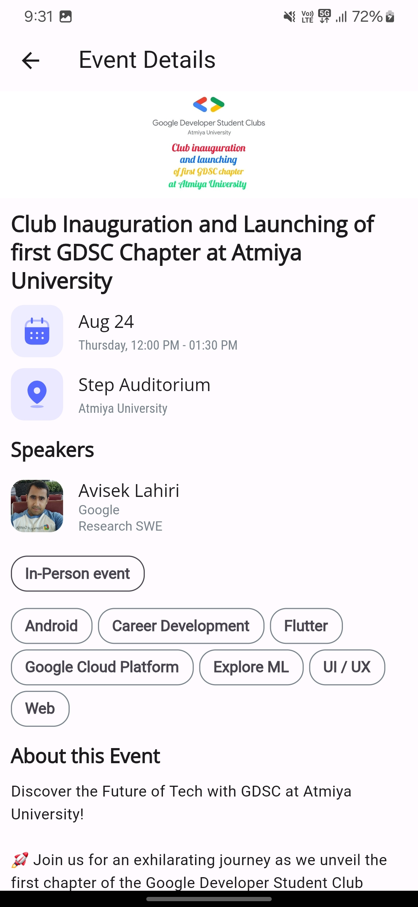
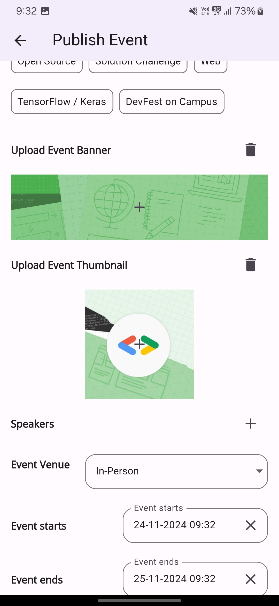
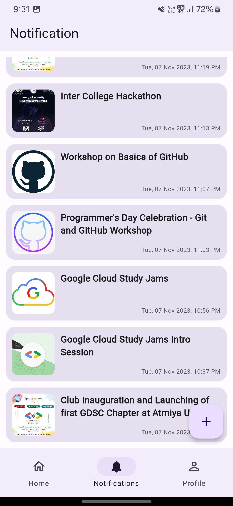
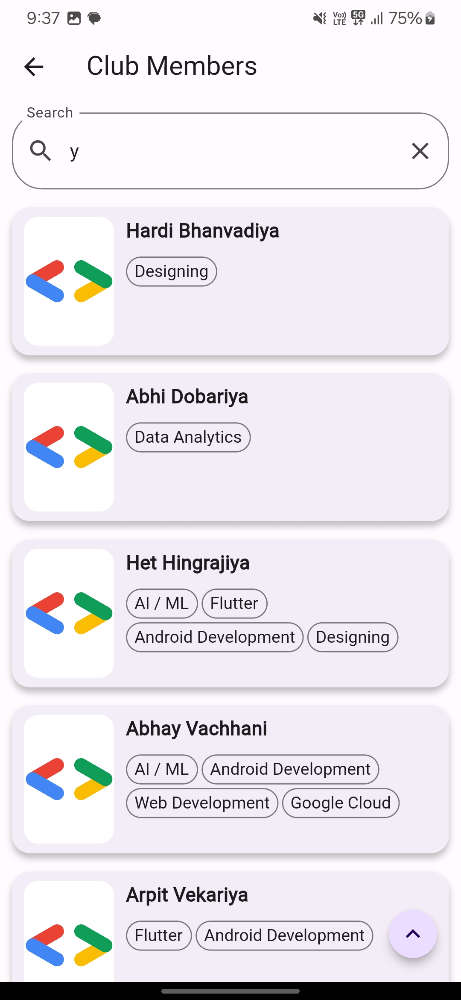
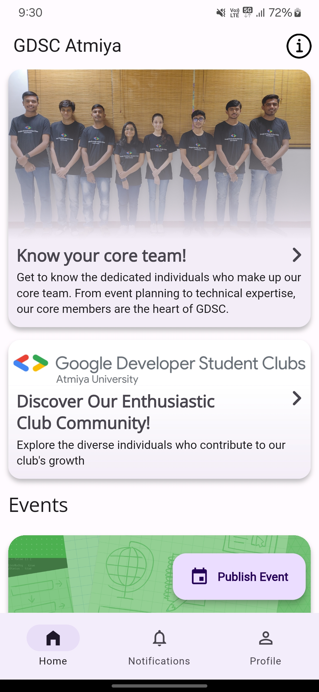
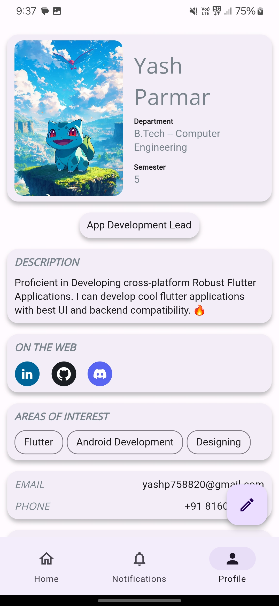

# GDSC Atmiya

An app for our college's Google Developer Student Club (GDSC) chapter, designed to keep members informed about upcoming events, provide updates, and foster connections among peers.

## Built using

The app is built using [Flutter](https://flutter.dev/) for cross-platform development, [Firebase](https://firebase.google.com/) for backend services, 
and [OneSignal](https://onesignal.com/) for push notifications.

## Features

- [**Event Updates** - Stay informed about upcoming events, workshops, and meetups.](#event-updates)
- [**Member Connections** - Connect with fellow GDSC members and collaborate effectively.](#member-connections)
- [**Club & Core Team Profiles** - Explore profiles of club members and the core team.](#club--core-team-profiles)

   ### Event Updates
    Stay informed about upcoming events, workshops, and meetups with detailed information and schedules. Receive notifications to never miss an important update.
    

      
      &nbsp;&nbsp;&nbsp;
      
      &nbsp;&nbsp;&nbsp;
      
    

   ### Member Connections
    Easily connect with fellow GDSC members through the app, fostering collaboration and networking within the community.
    

      
      &nbsp;&nbsp;&nbsp;
      
    

   ### Club & Core Team Profiles
    Explore profiles of club members and the core team. Learn more about their roles, expertise, and contributions to the GDSC chapter.
    

      
      &nbsp;&nbsp;&nbsp;
      
    

